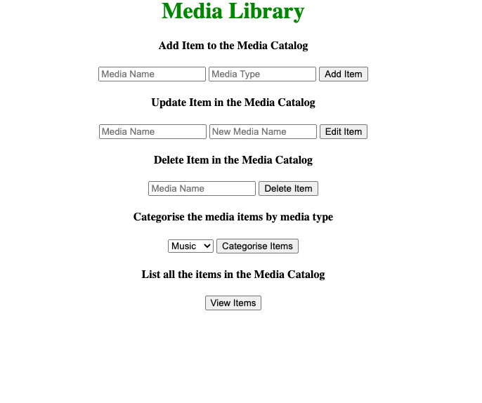
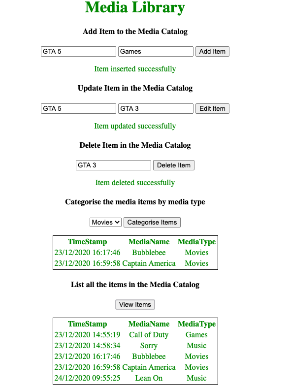

# MediaLibrary

Application that allows users to curate their media libraries

## Application Details


Application allows users to add, edit, delete, view and categorise the media items. The media types supported are Movies, Music and Games. 

This application is developed using Django Web Framework, sqlite3 is used for persistent storage.


- Prerequites for this application
  - python 3.x.x
  - django 3.x.x


- How to run this application?
  - Clone this repository
  - Go to the MediaLibrary folder
  - Run the command `python manage.py runserver`

## Homeage

<p align="center">
  
</p>

## API Specification


### Add Media Item to the Catalog
---

**Adding media item to the Media Library**

* **URL**

  <_`/v1/media/add`_>

* **Method**

  <_`POST`_>

* **Data Params**

  ```json
  {"mediaType": "Music", "mediaName": "Roar"}
  ```

* **Success Response:**

  * **Code:** 200 <br />
    **Response:** `{ responseCode : 200, message : "Item inserted successfully" }`
 
* **Error Response:**
    
  * **Code:** 400 <br />
    **Response:** `{ responseCode : 400, message : "Invalid Media Type" }`
    
    OR
    
  * **Code:** 400 <br />
    **Response:** `{ responseCode : 400, message : "Item Roar already exists in db" }`
    
    OR 
    
  * **Code:** 400 <br />
    **Response:** `{ responseCode : 500, message : "Error while inserting the element in database." }`
    
    
    
    
 ### Update Media Item in the Catalog
---

**Updating media item in the Media Library**

* **URL**

  <_`/v1/media/edit`_>

* **Method**

  <_`PUT`_>

* **Data Params**

  ```json
  {"mediaName": "Roar", "newMediaName": "Lean On"}
  ```


* **Success Response:**

  * **Code:** 200 <br />
    **Response:** `{ responseCode : 200, message : "Item updated successfully" }`
 
* **Error Response:**
  
  * **Code:** 404 <br />
    **Response:** `{ responseCode : 404, message : "Media item does not exist in database" }`
    
    OR
    
  * **Code:** 500 <br />
    **Response:** `{ responseCode : 500, message : "Error while updating the item in database" }`
    
    
    
### Delete Media Item in the Catalog
---

**Removing media item in the Media Library**

* **URL**

  <_`/v1/media/delete`_>

* **Method**

  <_`DELETE`_>

* **Data Params**

  ```json
  {"mediaName": "Roar"}
  ```


* **Success Response:**

  * **Code:** 200 <br />
    **Response:** `{ responseCode : 200, message : "Item deleted successfully" }`
 
* **Error Response:**
  
  * **Code:** 404 <br />
    **Response:** `{ responseCode : 404, message : "Media item Roar does not exist in database" }`
    
    OR
    
  * **Code:** 500 <br />
    **Response:** `{ responseCode : 500, message : "Error while deleting the item from database" }`
    

    
### Categorize Media Items in the Catalog
---

**Categorizing media items by media type in the Media Library**

* **URL**

  <_`/v1/media/view/<mediaType>`_>

* **Method**

  <_`GET`_>

* **Success Response:**

  * **Code:** 200 <br />
    **Response:** `[{"timeStamp": 23/12/2020 14:55:19, "mediaName": "Call of Duty", "mediaType": "Games"}, ...]`
 
* **Error Response:**
  
  * **Code:** 500 <br />
    **Response:** `{ responseCode : 500, message : "Error while fetching items from database" }`
    
 
 ### View Media Items in the Catalog
---

**Viewing media items in the Media Library**

* **URL**

  <_`v1/media/view`_>

* **Method**

  <_`GET`_>

* **Success Response:**

  * **Code:** 200 <br />
    **Response:** `[{"timeStamp": 23/12/2020 14:55:19, "mediaName": "Call of Duty", "mediaType": "Games"}, ...]`
 
* **Error Response:**
  
  * **Code:** 500 <br />
    **Response:** `{ responseCode : 500, message : "Error while fetching items from database" }`


## Output Screenshot

  <p align="center">
    
  </p>
